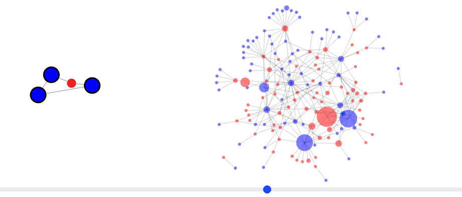

# Gramex Network Workshop

This workshop is for JavaScript developers on using [gramex-network](https://gramener.com/gramex-network/) to build knowledge graphs using force-directed layouts.

Pre-requisites: HTML, SVG, JavaScript, and (ideally) a working knowledge of [D3](https://d3js.org/).

## About graphs

Graphs are made of nodes (circles, entities) and links (lines, relations). Identify them first.

For example,

- [Nodes could be developers on Github. Links could be whether one follows another](https://gramener.com/codersearch/)
- [Nodes could be words in a sonnet. Links could be whether a word follows another](https://gramener.com/shakespeare/network.html?sonnet=5)
- [Nodes could be characters in the Mahabharatha. Links could be whether they're mentioned in the same sentence](https://gramener.com/mahabharatha/closeness)
- [Nodes could be supply points. Links could be whether a point is next to another on a route](https://gramener.com/routemap/)
- [Nodes could be software. Links could be whether they are alternatives for each other](https://gramener.com/software/)
- [Nodes could be companies. Links could be whether they filed a patent litigation against each other](https://gramener.com/patentlitigation/)
- [Nodes could be research papers. Links could be whether they are similar enough to each other](https://gramener.com/docexplore/biomolecule-papers/)
- [Nodes could be patent categories, countries and keywords. Links could be whether a patent connects any of them](https://gramener.com/ipanalysis/)

These visualizations uses [`d3.force`](https://d3js.org/d3-force). [`@gramex/network`](https://gramener.com/gramex-network/) is a convenience library on top of it.

This workshop teaches you how you can build such networks.

## Set up simple data

The `network()` function accepts a `{ nodes, links }` object.

- `nodes` is an array of objects.
- `links` is an array of `{ source, target }` objects that to the node by index number or by reference.

```json
{
  "nodes": [{ "name": "Alice" }, { "name": "Bob" }, { "name": "Carol" }],
  "links": [
    { "source": 0, "target": 1 },
    { "source": 1, "target": 2 }
  ]
}
```

## Render simple network

**STEP 1**: [Log into Codepen](https://codepen.io/login) and [Create a new pen](https://codepen.io/pen/) titled `Gramex Network workshop`

**STEP 2**: Go through each line in this code and add it to the HTML.

```html
<svg id="simple" width="300" height="100"></svg>

<script type="module">
  // Import the Gramex network library
  import { network } from "https://cdn.jsdelivr.net/npm/@gramex/network@2";
  // Import the underlying D3 library
  import * as d3 from "https://cdn.jsdelivr.net/npm/d3@7/+esm";

  // Create the nodes as an array of objects. One object per circle
  const nodes = [{ name: "Alice" }, { name: "Bob" }, { name: "Carol" }];
  // Create a links as an array of source-target index pairs. Each pair is a line
  const links = [
    { source: 0, target: 1 },
    { source: 1, target: 2 },
  ];
  // Draw the network. This is a shortcut for { nodes: nodes, links: links, d3: d3 }
  // Note that we pass d3 -- that's to let the network use our specific version of D3.
  const graph = network("#simple", { nodes, links, d3 });
  // `graph` returns an object with { nodes, links }. These are D3 joins. You can style them
  // Fill the SVG in red and give it an 8px radius.
  graph.nodes.attr("fill", "red").attr("r", 8);
  // Make the links grey and semi-transparent
  graph.links.attr("stroke", "rgba(0,0,0,0.2)");
</script>
```

The output should look like this:

[](docs/simple.html ":include height=120px")

Notice a few things that `@gramex/network` automatically does:

1. **DRAG** each node by clicking and dragging it
2. **PIN** the node when you release it
3. **UNPIN** a pinned node by double-clicking it
4. **UNPIN** _all_ pinned nodes by double-clicking anywhere else

These are useful features to explore the network.

When dragging, the node gets a `dragging` class. When pinned, it gets a `pinned` class. You can use this to style nodes that are dragged or pinned.

Add this to your CSS to style nodes when dragged or pinned:

```css
.dragging {
  stroke: black;
  stroke-width: 5;
}
.pinned {
  stroke: black;
  stroke-width: 3;
}
```

### Exercise #1

1. Add a new node "David" to the nodes array. Add a new link from "Carol" to "David" and from "David" to "Alice".
2. Change the color of the nodes to blue and the links to green.
3. Change the radius of the nodes to 10px and the opacity of the links to 0.5.

## Dynamic styling

The node and link styles can be dynamic, based on data. For example, modify `graph.nodes....` to:

```js
graph.nodes
  // Bob is red, others are blue
  .attr("fill", (d) => (d.name === "Bob" ? "red" : "blue"))
  // Longer names are bigger
  .attr("r", (d) => d.name.length * 3);
```

## Add tooltips

You can use [Bootstrap tooltips](https://getbootstrap.com/docs/5.3/components/tooltips/).

Add this to the top of your HTML:

```html
<link href="https://cdn.jsdelivr.net/npm/bootstrap@5.3.3/dist/css/bootstrap.min.css" rel="stylesheet" />
<script src="https://cdn.jsdelivr.net/npm/bootstrap@5.3.3/dist/js/bootstrap.bundle.min.js"></script>
```

Modify your `graph.nodes` to add:

```js
graph.nodes.attr("data-bs-toggle", "tooltip").attr("title", (d) => d.name);
```

Add this to the end of your script:

```js
new bootstrap.Tooltip("body", { selector: '[data-bs-toggle="tooltip"]' });
```

Now, you should be able to see tooltips when you hover over the nodes.

### Exercise #2

1. Modify the tooltip to show their names in uppercase.
2. Add the length of their names in the tooltip (e.g. "ALICE (5)").
3. Position the tooltip on the left of the node using the [tooltip direction](https://getbootstrap.com/docs/5.3/components/tooltips/#directions)

## Tabular data

Any tabular data can be converted into a node-link structure. For example, take this [table of countries and religions](docs/country-religion.csv ":ignore"):

[](docs/country-religion.csv ":ignore")

Convert this into a flat array of objects like this:

```js
const data = [
  { Country: "USA", Religion: "Christian", Population: 100 },
  { Country: "UK", Religion: "Christian", Population: 90 },
  { Country: "Iran", Religion: "Muslim", Population: 80 },
];
```

Now you can convert it to a node-link dataset using `{ nodes, links } = kpartite(data, keys, values)`. It accepts 3 parameters:

1. `data` - array of objects containing the data.
2. `keys` - object of `{key: column}` pairs or an array of `[key, column]` pairs.
   - `key` is a string node type
   - `column` is the string name of a field in data, or a function(object) that returns the field, or a static value.
3. `values` - object of accessor functions for link values that are aggregated across links and nodes

For example:

```js
const { nodes, links } = kpartite(
  data,
  {
    Country: "Country", // Create a node for each country
    Religion: (d) => d.Religion, // Create a node for each religion
  },
  {
    count: 1, // Count the number of links between countries and religions
    Population: "Population", // Sum the population of countries and religions
  },
);
```

This creates the following `nodes`:

```js
[
  {
    key: "Country",
    value: "USA",
    id: '["Country","USA"]',
    count: 1,
    Population: 100,
  },
  {
    key: "Religion",
    value: "Christian",
    id: '["Religion","Christian"]',
    count: 2,
    Population: 190,
  },
  // ... etc.
];
```

... and the following `links`:

```js
[
  {
    source: {}, // link to USA source node
    target: {}, // link to Christian target node
    id: '["[\\"Country\\",\\"USA\\"]","[\\"Religion\\",\\"Christian\\"]"]',
    count: 1,
    Population: 100,
  },
  // ... etc.
];
```

Try it out. Add this to the bottom of your HTML:

```html
<svg id="religion" width="600" height="380"></svg>

<script type="module">
  import { network } from "https://cdn.jsdelivr.net/npm/@gramex/network@2";
  // Load the kpartite function from the network library
  import { kpartite } from "https://cdn.jsdelivr.net/npm/@gramex/network@2/dist/kpartite.js";
  import * as d3 from "https://cdn.jsdelivr.net/npm/d3@7/+esm";

  // Load the data
  const data = await fetch("https://gramener.com/gramex-network/docs/country-religion.json").then((r) => r.json());
  // Convert tabular data into a node-link structure
  const { nodes, links } = kpartite(
    data,
    { country: "Country", religion: "Religion" },
    { count: 1, Population: "Value" },
  );

  // Create the network
  const graph = network("#religion", { nodes, links, d3 });
  graph.nodes
    // countries are in red, religions are in blue
    .attr("fill", (d) => (d.key == "country" ? "rgba(255,0,0,0.5)" : "rgba(0,0,255,0.5)"))
    .attr("r", 5);
  graph.links.attr("stroke", "rgba(0,0,0,0.2)");
</script>
```

### Exercise #3

1. Modify the radius based on the population. Perhaps a linear scale from 3 to 20 based on the population.
2. Add a tooltip to show the country / religion.

## Filter nodes and links

To dynamically filter nodes and links, pass a subset of the **SAME** `nodes` and `links`.

Make sure the nodes and links are the same objects as the original nodes and links. This ensures that the simulation is not restarted.

For example, add this range slider:

```html
<input type="range" min="0" max="10" step="0.1" value="6" id="link-filter" class="form-range" />
```

Modify the graph drawing code (starting from `// Create the network`) as follows:

```js
function draw() {
  // Filter the data
  const minPopulation = Math.pow(10, document.querySelector("#link-filter").value);
  const filteredLinks = links.filter((d) => d.Population >= minPopulation);
  const filteredNodes = nodes.filter((d) => filteredLinks.some((l) => l.source == d || l.target == d));

  // Create the network
  const graph = network("#religion", { nodes: filteredNodes, links: filteredLinks, d3 });

  // Style the network
  const rScale = d3
    .scaleLinear()
    .domain(d3.extent(nodes, (d) => d.Population))
    .range([3, 20]);
  graph.nodes
    .attr("fill", (d) => (d.key == "country" ? "rgba(255,0,0,0.5)" : "rgba(0,0,255,0.5)"))
    .attr("r", (d) => rScale(d.Population))
    .attr("data-bs-toggle", "tooltip")
    .attr("title", (d) => d.value);
  graph.links.attr("stroke", "rgba(0,0,0,0.2)");
}

draw();
document.querySelector("#link-filter").addEventListener("input", draw);
new bootstrap.Tooltip("#network", { selector: '[data-bs-toggle="tooltip"]' });
```

### Exercise #4

1. Modify the tooltip to show the country / religion and the population (e.g. "USA (100)").

## Further exploration

- [Brushing](https://gramener.com/gramex-network/#/?id=brushing)
- [Arrows](https://gramener.com/gramex-network/#/?id=arrows)
- [Curved links](https://gramener.com/gramex-network/#/?id=curved-links)
- [Unipartite data](https://gramener.com/gramex-network/#/?id=tabular-unipartite-data)
- Layouts
  - [Tree](https://observablehq.com/@d3/force-directed-tree)
  - [Circle packing via collision](https://observablehq.com/@d3/collision-detection/2)
  - [Clustered bubbles](https://observablehq.com/@d3/clustered-bubbles)
  - [Multi](https://gist.github.com/mbostock/1021953) [foci](https://gist.github.com/mbostock/1021841)
  - [Radialized](https://flowingdata.com/2012/08/02/how-to-make-an-interactive-network-visualization/)
  - [Lattice](https://observablehq.com/@d3/force-directed-lattice)
- [Shapes](https://gramener.com/gramex-network/#/?id=node-shapes-and-labels)
  - [Bi-directional networks with 2 curved arrows](https://gist.github.com/d3noob/5155181)
  - [Labels](https://gist.github.com/mbostock/950642)
  - [Images in nodes](https://gist.github.com/eesur/be2abfb3155a38be4de4)
- Interaction
  - [Collapsible force layout](https://gist.github.com/mbostock/1062288)
  - [Static web workers](https://observablehq.com/@d3/static-force-directed-graph)

## Submit your code

[Create an issue](https://code.gramener.com/cto/gramex-network-workshop/-/issues/new?issue[title]=Exercise+submission&issue[description]=Link+to+my+CodePen:+ ":ignore") titled `Exercise submission`. Add a link to your CodePen and submit the issue.

## Verification

Check if the output looks like this:



<!--
## Video

[](https://youtu.be/VMkOznTrB2o)
-->
